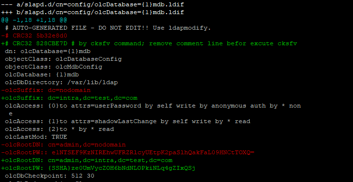
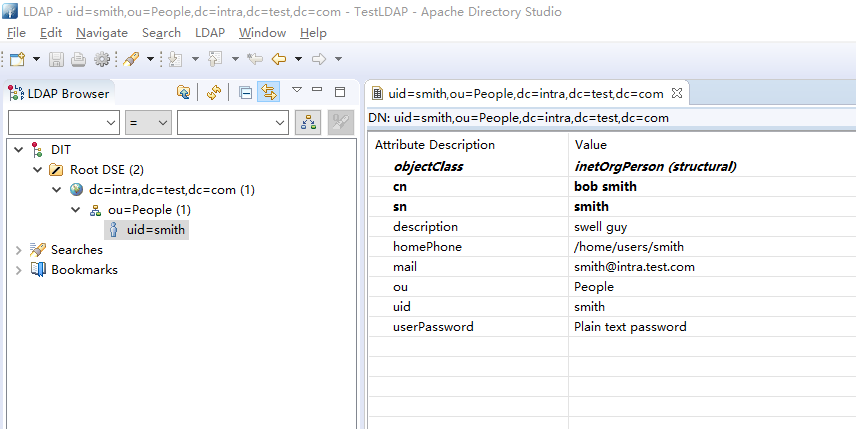

# 基本配置

## cn=config 目录是OpenLDAP的全局配置目录


## 默认情况下OpenLDAP是不能连接的，需更改ldif文件

虽然所有ldif文件第一行就明确指出`# AUTO-GENERATED FILE - DO NOT EDIT!! Use ldapmodify.`... ...



olcSuffix、olcRootDN、olcRootPW分别按需修改，其中

* olcRootPW可通过`slappasswd -s 密码`生成
* CRC32 校验可通过cksfv计算和修改，
否则`slaptest -F /etc/ldap/slapd.d`会有警告`xxxxxxxx 5c93a983 ldif_read_file: checksum error on "/etc/ldap/slapd.d/cn=config/olcDatabase={1}mdb.ldif"`
* cksfv计算前需要把#开头的注释内容去掉


重启slapd服务后，可通过`Apache Directory Studio`一类客户端工具进行连接

* bind dn：cn=admin,dc=intra,dc=test,dc=com
* bind password：olcRootPW对应的值

## 通过ldif文件创建DIT structure和添加一个测试用户

init_config.ldif
```
# base DN
dn: dc=intra,dc=test,dc=com
objectclass: dcObject
#dc: intra.test.com #additional info: value of single-valued naming attribute 'dc' conflicts with value present in entry
objectclass: organization
description: test tech company
o: Test

# create ou; first level
dn: ou=People,dc=intra,dc=test,dc=com
ou: People
description: All people
objectclass: organizationalunit

# creat person; second level
dn: uid=smith,ou=People,dc=intra,dc=test,dc=com
objectclass: inetOrgPerson
cn: bob smith
sn: smith
uid: smith
userpassword: 123456
homephone: /home/users/smith
mail: smith@intra.test.com
description: swell guy
ou: People

```

ldapadd -x -W -D 'cn=admin,dc=intra,dc=test,dc=com' -f init_config.ldif

客户端查看效果如下：


