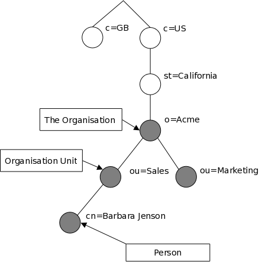
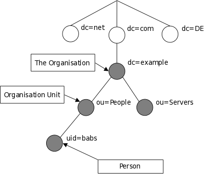

# LDAP/OpenLDAP 初实

## LDAP 是什么？

LDAP是'Lightweight Directory Access Protocol'简写，中文直译的话称作'轻量级目录访问协议'

那么会引申出什么是directory service？

`
A directory is a specialized database specifically designed for searching and browsing, in additional to supporting basic lookup and update functions.
`

LDAP是怎样存储信息的？

树状结构，LDAP的信息模型基于entries（条目），entries是全局唯一属性（globally-unique Distinguished Name）的集合。

每颗树只有一个root entry，我们称之为naming context或者suffix（后缀）

LDAP是怎样定义信息的？

通过objectClass来控制条目中所需和允许的属性（attribute），属性的值必须遵从schema（模式）规则。

两种命名方式：

traditional naming

internet naming

## OpenLDAP 是什么，跟LDAP什么关系？

OpenLDAP是一个软件，是LDAP这个协议的开源实现

