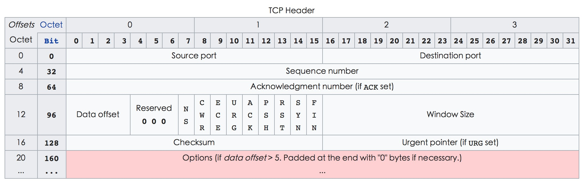

## TCP/IP 协议头

### IP HEADER

[wiki: IPV4#Header](https://en.wikipedia.org/wiki/IPv4#Header)

* Version: 4 bit 版本信息
* IHL: 4 bit Internet Header Length. Internet头部长度. 此单位为32 bit(4 bytes). 4 bit 全部占满时为1111, 10进制为15, 最大长度为15 * 4 bytes = 60 bytes, 最长用的是0101即20 bytes.
此字段值必须为32 bit(4 bytes)的倍数, 不足时用最后的填充字段填充.
* DSCP: 6 bit Differentiated Services Code Point. 代替过时的type of service(ToS)字段
* ECN: 2 bit Explicit Congestion Notification. 显示拥堵通知. 需要端到端支持, 发送端提前感知中间路径堵塞, 降低发送速率.
* Total Length: 16 bit. 包括头数据. 最小值为20 bytes(没有数据), 最大值65535 bytes. 实际会对报文分片进行传输
* Identification: 16 bit 标识字段, 唯一标识IP的分片组
* Flags: 3 bit
  * bit 0: 保留, 必须为0
  * bit 1: Don't Fragment(DF). 如果设置并且需要分段路由数据时则丢弃此数据包. 可用来[Path MTU Discovery](https://en.wikipedia.org/wiki/Path_MTU_Discovery)
  * bit 2: More Fragment(MF). 对于未分段的数据包,MF标志被清除. 对于分段数据包,除最后一个之外的所有分段都设置了MF标志. 最后一个片段具有非零片段偏移字段, 将其与未分段的数据包区分开来.
* Fragment Offset: 分片偏移. 每个分片相对于原始报文头的偏移量, 以8 bytes为单位. 最大值(2的13次方-1) * 8 = 65528 bytes

* Time To Live: 8 bit 存活时间. 最大255, 每经过一跳减1. 避免报文一直在互联网中存在, 例如环路.
* Protocol: 8 bit 数据使用的协议. [协议列表](https://en.wikipedia.org/wiki/List_of_IP_protocol_numbers)
* Header Checksum: 16 bit 头部校验和. 每经过1跳, TTL会减1, 路由器会重新计算校验和, 不匹配的会丢弃.
* Source IP Address: 源地址. 经过NAT设备时此地址可能会更改.
* Destination IP Address: 目的地址. 经过NAT设备时此地址可能会更改.
* Options: 可选字段, 不经常使用.

### TCP HEADER

[wiki: Transmission_Control_Protocol#TCP_segment_structure](https://en.wikipedia.org/wiki/Transmission_Control_Protocol#TCP_segment_structure)

### UDP HEADER

[wiki: User_Datagram_Protocol](https://en.wikipedia.org/wiki/User_Datagram_Protocol)

* Source port: 16 bit 源端口
* Destination port: 16 bit 目的端口
* Length: UDP头和UDP数据的长度. 字段最小值8 bytes, 理论最大值65535 bytes(8 bytes header + 65527 bytes of data). 但是底层IPv4协议附加的IP头, 实际最大值是65507 bytes(65535 - 8 bytes udp header - 20 bytes IP header)
* Checksum: 校验和. 用于头和数据的错误校验. IPv4可选, IPv6强制. 如果未使用用0填充
